# CROP.AI — Crop Advisory System Web App

## Setup & Run

```bash
# 1. Install dependencies
pip install -r requirements.txt

# 2. Make sure Crop_recommendation.csv is in this folder

# 3. Run the app
python app.py

# 4. Open browser at
http://localhost:5000
```

## Output
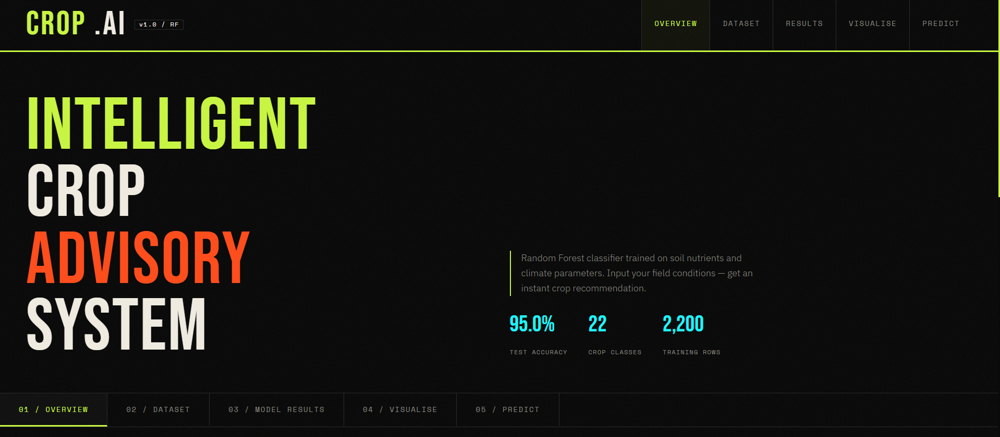
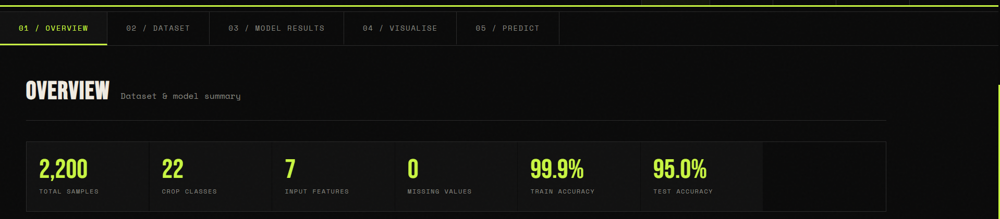
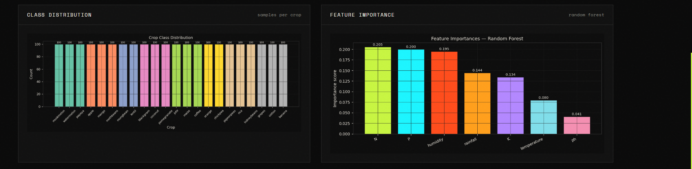
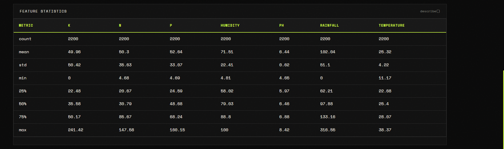
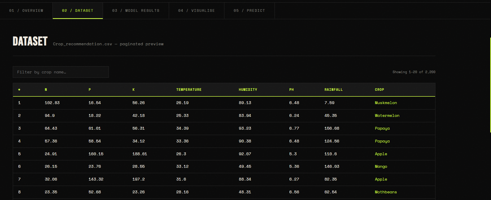
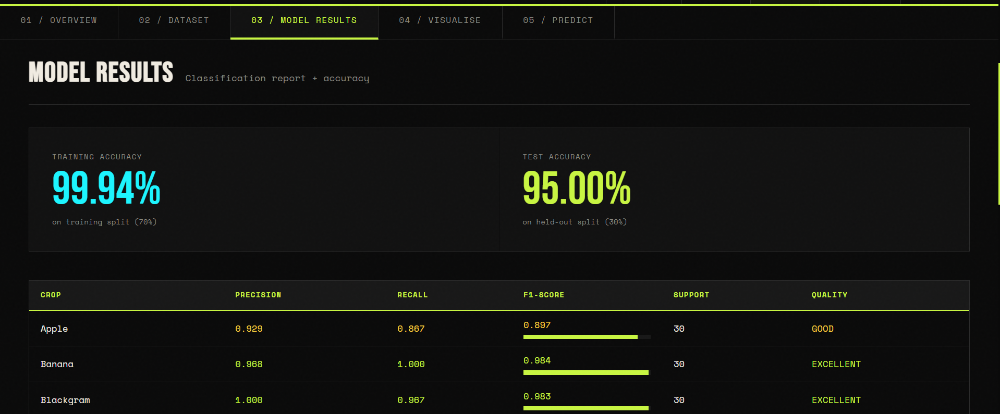
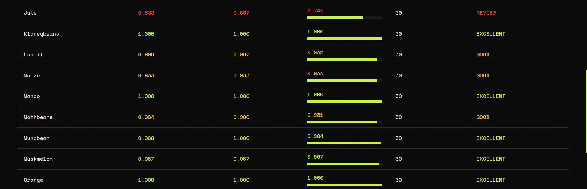
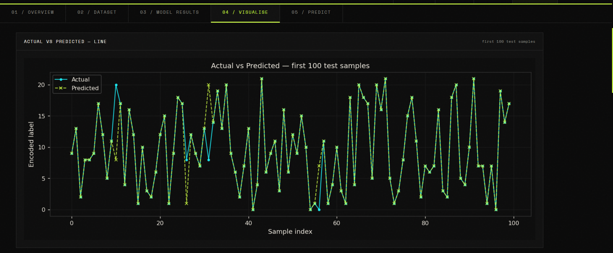
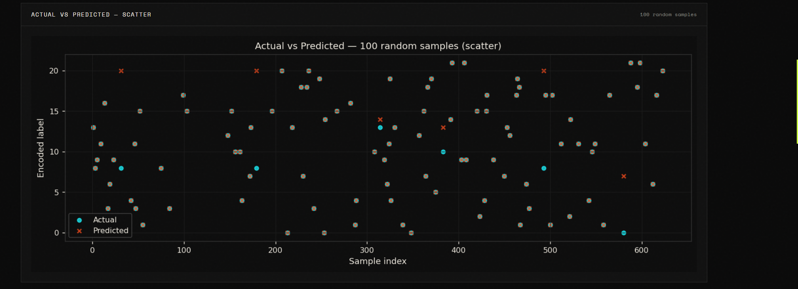
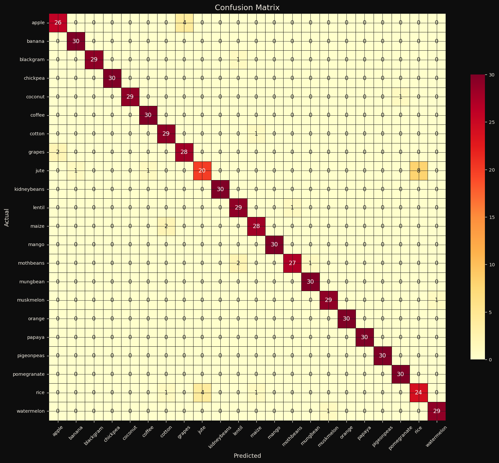
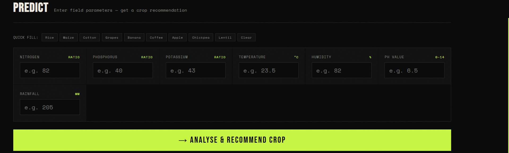
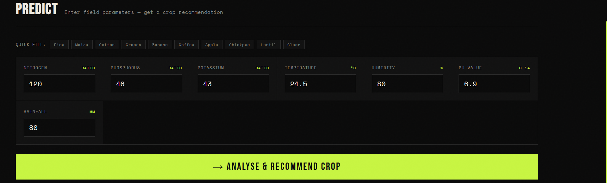
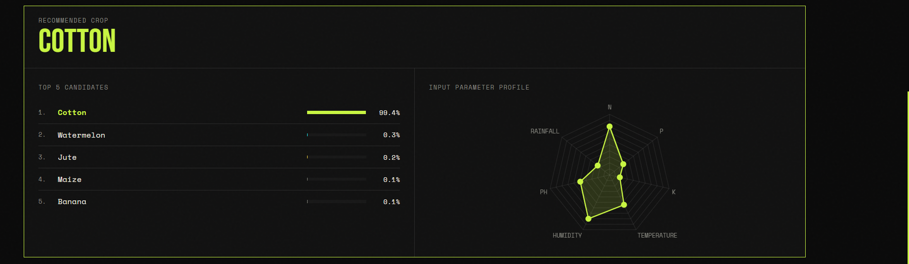
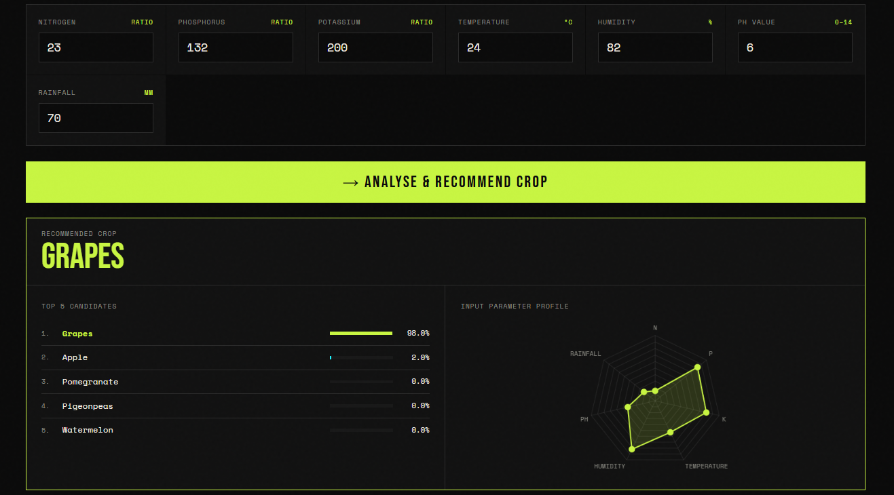

## Features
- **Overview** — dataset stats, class distribution, feature importance charts
- **Dataset** — paginated, searchable table of all 2200 rows
- **Results** — train/test accuracy + full classification report per crop
- **Visualise** — actual vs predicted (line + scatter) + confusion matrix heatmap
- **Predict** — enter N/P/K/temp/humidity/pH/rainfall → get crop recommendation with top-5 probabilities + radar chart

## File Structure
```
crop_app/
├── app.py                    ← Flask backend + ML training
├── Crop_recommendation.csv   ← Dataset
├── requirements.txt
└── templates/
    └── index.html            ← Frontend (brutalist UI)
```
